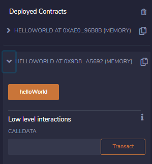

# ETH Remix IDE Cognitive Walkthrough

- Repository: https://github.com/ethereum/remix-project
- Web hosted IDE: https://remix.ethereum.org/

## The IDE on at first glance

Upon arriving at the first page of the IDE as a new user I'm a bit confused as to how I should start actually utilzing the IDE. There is no clear path for where I should placve my Solidity files (.sol extension). The Solidity file is where all the source code for my contract goes, this should be very obvious to a new user but is not.

## Further Inspection

After further inspection I notice that there are Solidity files stored for interactions with the web browser, but this still does not answer the question; where should I be coding my smart contract?

  

I've now discovered a suite of prebuilt tests for my contract that has yet to be created, this is a very handy feature to be had.

  

After conducting outside research on smart contracts and Solidity on the interent I've learned I should place my new smart contract under the "Artifacts" directory.

  

## New Contract

As seen below there is no provided default contract for a new user, no "Hello World" type example. This make it extremely difficult for someone that is new to Solidity and now new to the Remix IDE as well to start developing. One of the biggest questions I'm asking myself is what version of Solidity should I be using? 

  

I decided to navigate over to https://github.com/ethereum/solidity/releases and noticed version 0.7.5 was the latest stable release, this is the version I went with. Though I don't think a new user should necessarily have to do this kind of work as it makes the workflow clunky for a new user.

  

## Contract Code

The goal of this walkthrough is to keep things understandable while I disect the Remix IDE, therefore I decided to create a simple smart contract that will return "Hello World". Below is the code.

  

## Time to Compile

Because I've written a smart contract and interacted with Solidity before this tutorial it's obvious to me the next step is to compile the smart contract. Overall, the compile button was very easy to find on the left-hand side of the screen and lit up with indicators.

  

## Time to Deploy

The next logical step in this entire process is to deploy the smart contract to the Ethereum testnet. Therefore, it's only makes sense that the deploy button was place exactly below the compile button. This maakes the life a new user very easy, as the UI is laid out in logical steps that a user would take.

  

## Contract Deployed

After deploying my contract it shows me how many contracts I have deployed, the name of the contracts, and the methods beloning to the contract. From above you might remember the only function I added to my smart contract was a `hellWorld()` function; below you can see this method was deployed with the contract.

The next logical step was not clear, however I found myself clicking the `helloWorld` button shown below, and an output appeard in the terminal window.

  

## Output

Below is the intial output displayed in the terminal after clicking the `helloWorld` button from above. The output at first glance is a bit confusing as I'm not sure what to make of it and it's not very readable.

After tinkering around for a bit I figured out I could click on the actual output string and a dropdown of different objects appeared as shown below. Specifically, what we should be looking for is our `"Hello World"` string that should be returned from out smart contract. After much digging we see that our output `{"0": "string: Hello World"}` is stored in `decoded output`.

## Conclusion

Overall, for a new user I believe the Ethereum Remix IDE presents its pitfalls. As a first time user I did experience SOME difficulties that I feel a new user should not have to go through. However, that's not to say these difficulties were not resolveable with a little Google search.

I do have some recommendations for the Ethereum team though, of which I will list below.

1. When visitng the Remix IDE for the first time there should be a "Hello World" contract placed in front of users.
2. When creating a new contract, the latest stable release of Solditiy should automatically appear in my contract.
3. After compiling a contract there should be a more obvious indicator of success.
4. After deploying my contracts there should be more obvious instructions / indicators as far as where I should be looking for my output.
